# Base Concepts

- GridNotes is an experimental notebook-like rich text editor with high key efficiency.
- There are three modes in this app:

1. You are on "Edit mode" by default. Here, you can edit contents in a [Block](block.md).
2. If you click Shift key **once** (or click on a block), you enter "Select mode", where you can move, resize, or
   manipulate block(s).
3. If you click Shift key **twice** (or select menu form navigation bar), you enter "Insert mode", where you can insert
   objects like arrows, tables, or images.

- By switching these modes properly, we try to maximize keyboard-control over the entire app.
- Check out what you can do visiting our [playground]()!
